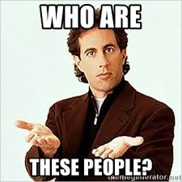

```{r setup, include=FALSE}
knitr::opts_chunk$set(echo = TRUE)

library(tidyverse)
library(googlesheets)
library(igraph)
library(ggraph)
library(knitr)


#grab the data from the googlesheet
data <- "https://docs.google.com/spreadsheets/d/1YsUYg0vrxi9oyW-0IcuE8XfAKGZb6MR7VlpmdChGI0A" %>% 
  gs_url() %>% 
  gs_read()


#separate the FirstContact column and gather to long format
Links <- data %>% 
  separate(FirstContact, 
           into = paste0("Contact", 1:(max(str_count(data$FirstContact, ",")) + 1)),
           sep = ",", fill = "right") %>% 
  gather(-Name, key = Contact, value = Target) %>% 
  select(Source = Name, Target) %>% 
  #remove NAs and trim
  filter(!is.na(Target)) %>% 
  mutate(Value = 1,
         Target = str_trim(Target))


#spread Links from long to wide and cluster
Nodes <- Links %>% 
  spread(key = Target, value = Value, fill = 0)
set.seed(20190605)
Nodes$cluster <- LETTERS[kmeans(Nodes[,-1], 4)$cluster]
Nodes <- Nodes %>% 
  select(name = Source, cluster)


#an alternative way to specify links
Links2 <- "https://docs.google.com/spreadsheets/d/1YsUYg0vrxi9oyW-0IcuE8XfAKGZb6MR7VlpmdChGI0A" %>% 
  gs_url() %>% 
  gs_read(ws = "edges")
```


At any large gathering with our friends, it seems the conversation inevitably turns to how the hell we all came to know each other.  Admitedly, I've never been total clear on that point myself.  I'll scan the room full of this [ragtag bunch of misfits](https://tvtropes.org/pmwiki/pmwiki.php/Main/RagtagBunchOfMisfits) and always ask myself the same question...

{width=200px}


## First Contact

In an effort to settle the question once and for all, I (naturally) created a spreadsheet.  [This Google Sheet](https://docs.google.com/spreadsheets/d/1YsUYg0vrxi9oyW-0IcuE8XfAKGZb6MR7VlpmdChGI0A) contains friends' names as well as each person's list of **"First Contacts"**.  

By First Contact, I mean who are the people you would have known without an introduction from someone else?  For example, my First Contacts include anyone who went to Westtown as well as Sandy.  However, I wouldn't have met anyone from Barleysheaf if it wasn't for one of my First Contacts.

```{r echo=FALSE}
kable(data[sample(nrow(data), 4),], caption = "A sample of First Contacts")
```

I know I've gotten some of these wrong.  Please update & add to [the spreadsheet!](https://docs.google.com/spreadsheets/d/1YsUYg0vrxi9oyW-0IcuE8XfAKGZb6MR7VlpmdChGI0A)


## Clusters of Contacts

It's tempting to put people into categories, like the "Westtown group" or the "Barleysheaf group".  However, some people fit into many such groups, and some fit into none at all.  Instead of categorizing people manually, we can turn to [cluster analysis](https://en.wikipedia.org/wiki/Cluster_analysis) to automatically categorize individuals based on who their first contacts are.  We'll start with four clusters for now, though that may need to be updated as more data is added.


## Visualising the Connections

Finally, we can use all this information to create a network plot of all individuals and their connections to each other.  Each individual is color-coded based on their cluster.  We can see for example that most of the Westtown group forms a distinct cluster, as does the Dickinson group.  Significant others are a distinct cluster as well!  I'm very curious to see how this evolves as more individuals and connections are added.

```{r social_network, echo=FALSE, fig.align="center", fig.width=6, fig.height=5, dpi = 300}
set.seed(20190605)
Links %>%
  graph_from_data_frame(vertices = Nodes) %>% 
  ggraph(layout = "fr") + 
  geom_edge_link(alpha = 0.2, width = 2) + 
  geom_node_point(aes(color = cluster), size = 10) + 
  geom_node_text(aes(label = name), color = "white", fontface = "bold", size = 2) + 
  theme_graph() + 
  theme(legend.position = "none") + 
  scale_color_brewer(palette = "Set1")
```


High-quality canvas prints will be available for sale shortly.


## Alternatives

Glen & Adam suggested that we more clearly show the type of connection between each person.  This gets kind of complicated since we're all "connected" now, but we'll try again to focus on the type of initial connection.  This data is stored on a [separate tab of the spreadsheet](https://docs.google.com/spreadsheets/d/1YsUYg0vrxi9oyW-0IcuE8XfAKGZb6MR7VlpmdChGI0A/edit#gid=1618818909) with relationship types like "High School", "Dickinson" and "Married".

I'm also going to break my own rules a bit and show Christine as connected with both Sean and Kevin, mostly because it's weird not to see the Robinsons connected.  Aww!!!

```{r alternative, echo=FALSE, fig.align="center", fig.width=6, fig.height=5, dpi = 300, warning=FALSE}
set.seed(20190605)
Links2 %>% 
  graph_from_data_frame(vertices = Nodes) %>% 
  ggraph(layout = "kk") + 
  geom_edge_link(alpha = 0.5, width = 2, aes(color = Type)) + 
  geom_node_point(aes(color = cluster), size = 10) + 
  geom_node_text(aes(label = name), color = "white", fontface = "bold", size = 2) + 
  theme_graph() + 
  scale_edge_color_brewer(palette = "Accent", name = "Relationship") + 
  scale_color_brewer(palette = "Set1") + 
  guides(color = FALSE) + 
  theme(legend.position = "bottom",
        legend.title = element_text(face = "bold"))
```


Sandy suggested that we also show how long the relationship has been going.  I added a "Year Met" column to [the second tab of the spreadsheet](https://docs.google.com/spreadsheets/d/1YsUYg0vrxi9oyW-0IcuE8XfAKGZb6MR7VlpmdChGI0A/edit#gid=1618818909); there's a lot of guesswork there on my part so please update it as needed.  We can use the length of the relationship to set the thickness of the edges connecting our nodes.

```{r alternative2, echo=FALSE, fig.align="center", fig.width=6, fig.height=5, dpi = 300, warning=FALSE}
set.seed(20190605)
Links2 %>% 
  mutate(RelationshipLength = 2019 - YearMet) %>% 
  graph_from_data_frame(vertices = Nodes) %>% 
  ggraph(layout = "kk") + 
  geom_edge_link(alpha = 0.5, aes(color = Type, width = RelationshipLength)) + 
  geom_node_point(aes(color = cluster), size = 10) + 
  geom_node_text(aes(label = name), color = "white", fontface = "bold", size = 2) + 
  theme_graph() + 
  scale_edge_color_brewer(palette = "Accent", name = "Relationship") + 
  scale_color_brewer(palette = "Set1") + 
  guides(color = FALSE,
         edge_width = FALSE,
         edge_color = guide_legend(override.aes = list(edge_width = 5))) + 
  theme(legend.position = "bottom",
        legend.title = element_text(face = "bold"),
        legend.key.width = unit(2, "cm"))
```